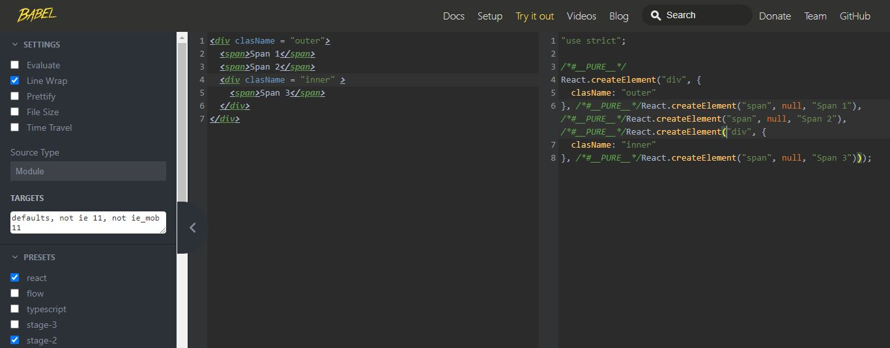

<div align="left">
  <a href="/README.md##React" id="home">Home</a>
</div>

## React Fundamentals

1. [Back to Basics without react](#01)
2. [Raw React Apis](#02)
3. [JSX and Babel to rescue](#03)
4. [propTypes](#04)

#### 01

##### Back to Basics without react

- In age old web pages we have a normal html file sent from the server and the js as client code executed on browser to add dynamic behaviour (add or remove html elements)
  as below

```html
<html>
  <body>
    <div id="root"></div>
    <script type="module">
      const rootElement = document.getElementById('root');
      const element = document.createElement('div');
      element.innerText = 'Hello World';
      rootElement.append(element);
    </script>
  </body>
</html>
```

- This way of adding / removing / modifing dom nodes is imperative (exactly tell dom what to do)
  REACT behaviour is declarative we tell dom what to do instead how to do (we do not interact with dom API instead React does it for us )

#### 02

##### Raw React Apis

- React app starts with 2 main Apis
  1 - React
  2 - ReactDom
- React
  For creating React elements (similar to document.createElement())
- ReactDom
  For Rendering React elements (similar to rootElement.appand())

We import React and ReactDom and change our app to a react app

Add react and ReactDom Scripts into body

```html
<html>
  <body>
    <div id="root"></div>
    <script src="https://unpkg.com/react@17.0.0/umd/react.development.js"></script>
    <script src="https://unpkg.com/react-dom@17.0.0/umd/react-dom.development.js"></script>
    <script type="module"></script>
  </body>
</html>
```

- As soon as you do this You get 2 global variables available to you in console type
  React , ReactDom you will see the magic

- Now as we told React is declarative we do not interact with dom nodes directly so see how we implement exact above hello world feature using react

```html
<html>
  <body>
    <div id="root"></div>
    <script src="https://unpkg.com/react@17.0.0/umd/react.development.js"></script>
    <script src="https://unpkg.com/react-dom@17.0.0/umd/react-dom.development.js"></script>
    <script type="module">
      const rootElement = document.getElementById('root');
      const element = React.createElement('div', {
        className: 'container',
        children: 'Hello World',
      });
      ReactDOM.render(element, rootElement);
    </script>
  </body>
</html>
```

- As you see we can write HTML inside Javascript file (script tag as above)
  lets say we want to render below Html using react
  - Raw HTML
  ```html
  <body>
    <div id="root">
      <div class="container">
        <span>Hello</span>
        <span>World</span>
      </div>
    </div>
  </body>
  ```
- With React

```html
<html>
  <body>
    <div id="root"></div>
    <script src="https://unpkg.com/react@17.0.0/umd/react.development.js"></script>
    <script src="https://unpkg.com/react-dom@17.0.0/umd/react-dom.development.js"></script>
    <script type="module">
      const rootElement = document.getElementById('root');
      const element = React.createElement('div', {
        className: 'container',
        children: [
          React.createElement('span', {
            children: 'Hello',
          }),
          React.createElement('span', {
            children: 'Wounderful React',
          }),
        ],
      });
      ReactDOM.render(element, rootElement);
    </script>
  </body>
</html>
```

Always remember if you want to create HTML elements in react it should be created with
React.createElement itself om a side note if you console lets say

```js
   let ui = React.createElement('span', {
            children: 'Wounderful React',
        })

{

// console o/p will be as below
$$typeof: Symbol(react.element)
key: null
props: {children: 'Wounderful React'}
ref: null
type: "span"
_owner: null
_store: {validated: false}
_self: null
_source: null
[[Prototype]]: Object
}

```

React can only render HTML elements on dom if element is of $$typeof: Symbol(react.element)
which can only be achieved by React.createELement but now the problem is writing multinested JSX is tough as you saw with a really simple example So now what is the solution

#### 03

##### JSX and Babel to rescue

So basically our problem was we can only create html elements for react using react.CreateElement
but writing nested structurs is tough so jsx comes and saves us

With jsx we can write tags more like html rather than
let element = React.createElement('span', {
children: 'Wounderful React',
})

JSX

```jsx
let element = <span>Wounderful React</span>;
```

Wow this looks simple and perfectly like HTML but there is a catch if you pass this to
ReactDom it does not understand this as React Element and gives error in console

```jsx
let element = <span>Wounderful React</span>;
console.log(ui);
ReactDOM.render(element, rootElement);
```

For above cod eto run we need to convert above element to something like

```jsx
let element = React.createElement('span', {
  children: 'Wounderful React',
});
```

Babel does that for us


Add babel to file and change the script type text/babel as follows

```html
<html>
  <body>
    <div id="root"></div>
    <script src="https://unpkg.com/react@17.0.0/umd/react.development.js"></script>
    <script src="https://unpkg.com/react-dom@17.0.0/umd/react-dom.development.js"></script>
    <script src="https://unpkg.com/@babel/standalone@7.12.4/babel.js"></script>

    <script type="text/babel">
      const rootElement = document.getElementById('root');
      let element = <span>Wounderful React</span>;
      console.log(element);
      ReactDOM.render(element, rootElement);
    </script>
  </body>
</html>
```

Just see below conversions of babel

jsx =>

```jsx
const test = (prop) => {
  return <div>{prop}</div>;
};
<test className='class-01' />;

Babel;

const test = (prop) => {
  return /*#__PURE__*/ React.createElement('div', null, prop);
};

/*#__PURE__*/
React.createElement('test', {
  className: 'class-01',
});
```

You see test goes as string , and test is not a valid html element now see below

```jsx
const Test = (prop) => {
  return <div>{prop}</div>;
};

<Test className='class-01' />;

Babel;

const Test = (prop) => {
  return /*#__PURE__*/ React.createElement('div', null, prop);
};

/*#__PURE__*/
React.createElement(Test, {
  className: 'class-01',
});
```

Okay so now we did not get as string but we got it as Function name which returns jsx absolutely valid

That is why If we want to make a custom component we Need to pass it as Upper Case first letter

#### 04

##### propTypes

When ever you want your props to be of a certain Type or you want them to be compulsary passed
we used propTypes
